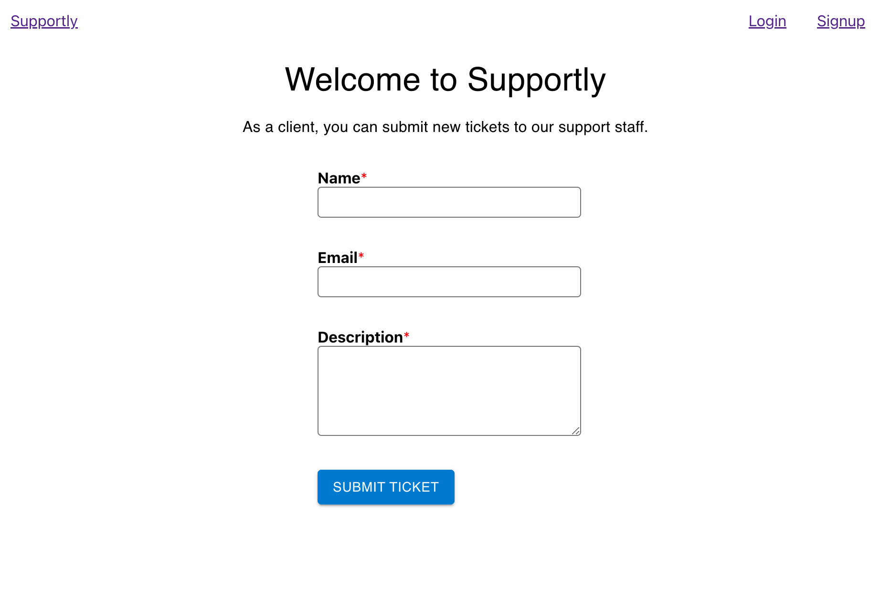
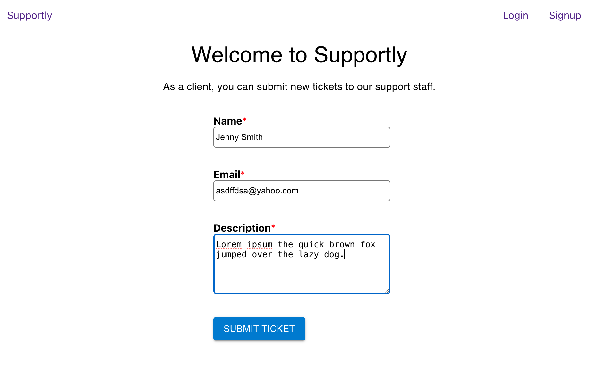
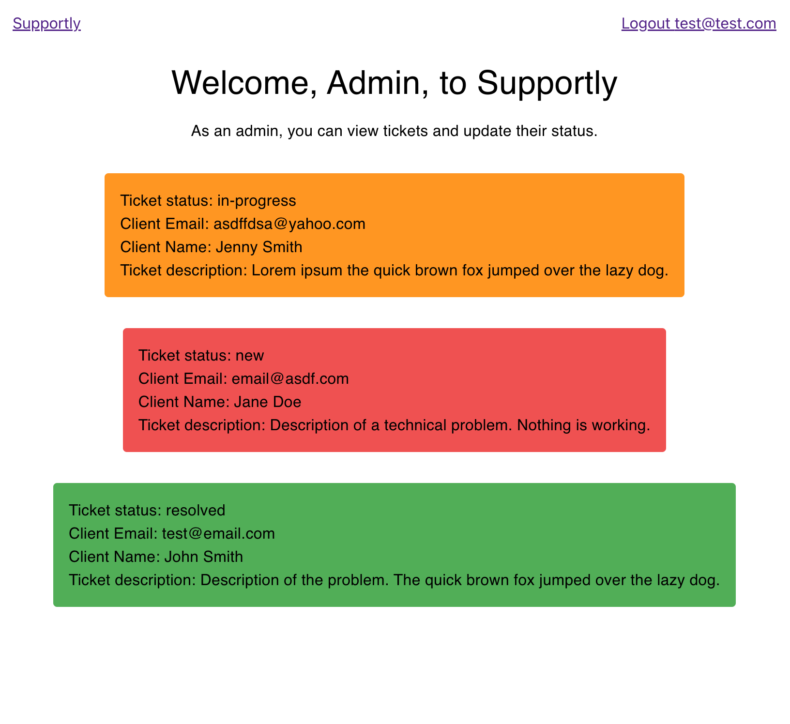
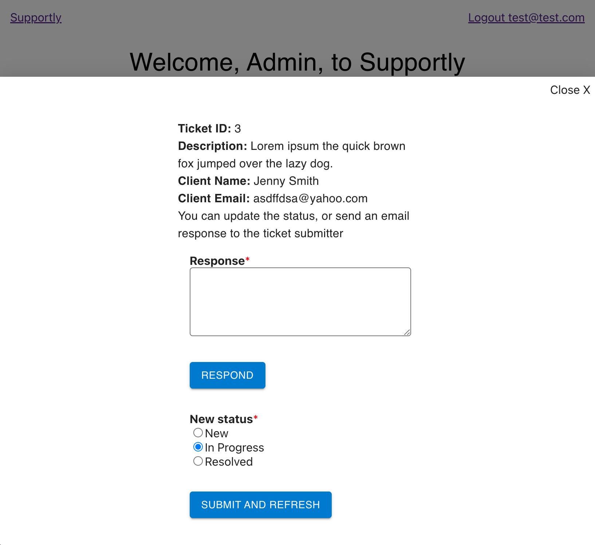
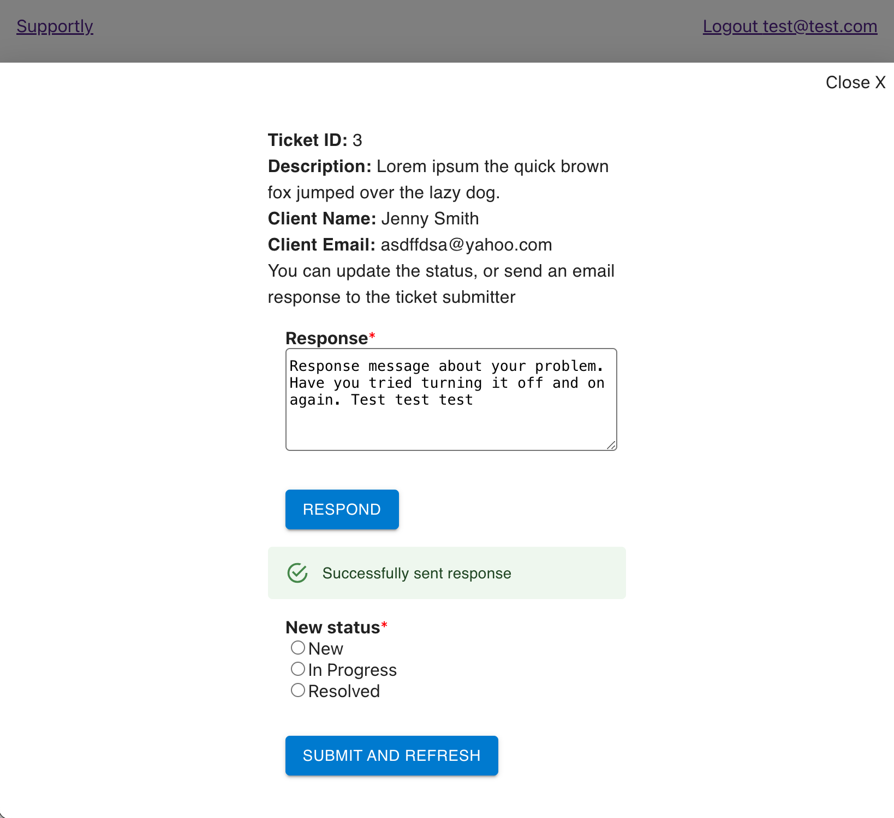
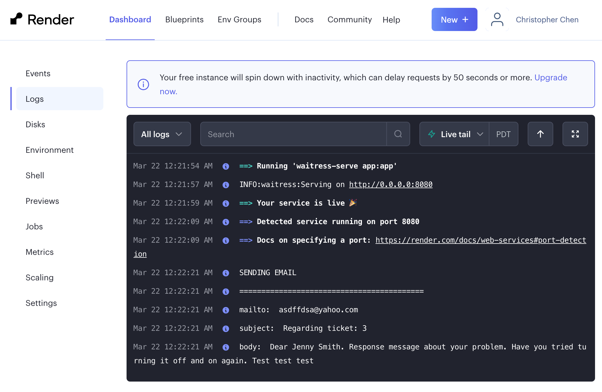
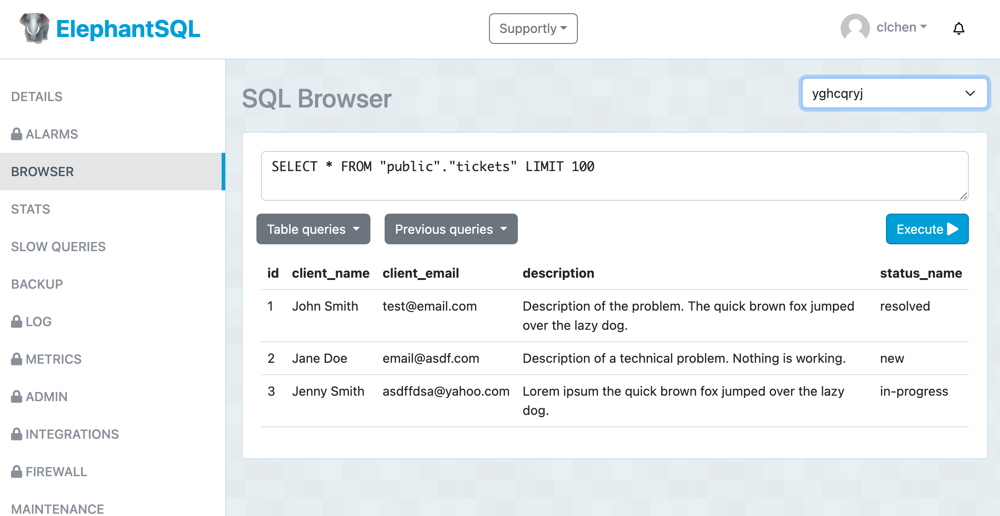

# Supportly

A simple support ticket management system.  

Anonymous/client users can submit tickets with name/email/description.  

Signup and login is available for admin accounts. Admins can view all tickets and click into tickets to update the ticket status ('new', 'in-progress', or 'resolved'). They can also send a dummy email response to the ticket submitter which is simply logged in the backend.  

Project is build with a React.js frontend deployed on Netlify, a Flask Python/SQLAlchemy backend deployed on Render, and a PostgreSQL database deployed on ElephantSQL.  

## [Live Demo](https://supportly.netlify.app/)  

  
Supportly client homepage  

  
Supportly client form filled homepage  

  
Supportly admin homepage with tickets display  

  
Supportly admin homepage with ticket edit modal  

  
Supportly admin homepage with form filled ticket edit modal  

  
Supportly Render backend email logged  

  
Supportly ElephantSQL database table  
